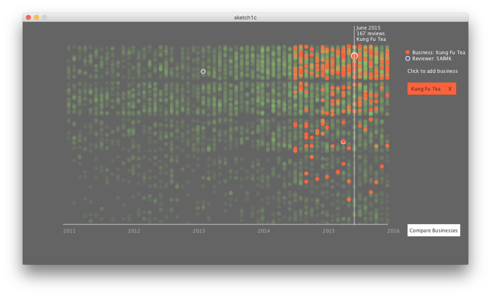

# Rise of the Cronut
A data visualization project. Popularity of a food, defined by how often it is mentioned in Yelp reviews, is charted over the last five years. From there, the user can dive in to explore how various restaurants and shops dominate the market.

### How it was built
The dataset, courtesy of Yelp, includes all businesses, reviews, and users from 10 cities around the world. Code was written in Java using an earlier version of Processing, and sadly the latest version has introduced a few bugs.

### Future improvements
- fix bug: color doesn't show in dot view
- refactor organization -- things got unwieldy as features were added
- import reviewer data
- add search function
- add compare function
- design a better "comparison" page

### How to run
Download and open with Processing 3.xx

